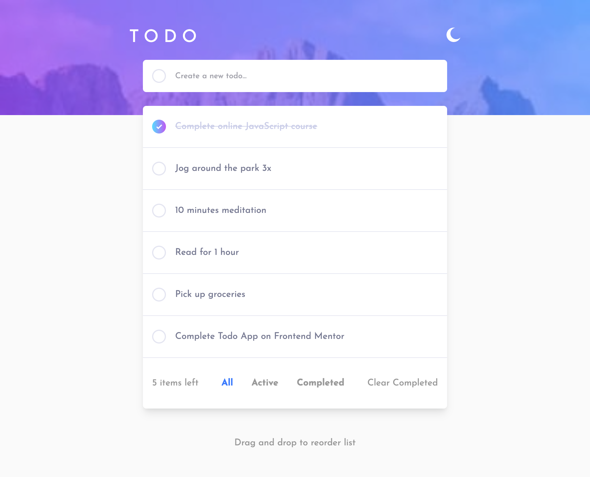

# Frontend Exercise - Todo app


## Table of contents

- [Welcome](#welcome)
- [Overview](#overview)
  - [The challenge](#the-challenge)
  - [Where to find everything](#where-to-find-everything)
  - [Screenshot](#screenshot)
- [My process](#my-process)
  - [Built with](#built-with)
  - [Useful resources](#useful-resources)
- [Submitting your solution](#submitting-your-solution)


## Welcome! 👋

Thanks for taking this front-end coding exercise.


**To do this challenge, you need a good understanding of HTML, CSS and JavaScript.**


## Overview

### The challenge

Your challenge is to build out this todo app and get it looking as close to the design as possible.

Users should be able to:

- View the optimal layout for the app depending on their device's screen size
- See hover states for all interactive elements on the page
- Add new todos to the list
- Mark todos as complete
- Delete todos from the list
- Clear all completed todos
- Toggle light and dark mode
- **Bonus**: 
  - Tested code
  - Drag and drop to reorder items on the list.
  - Filter by all/active/complete todos.


### Where to find everything

Your task is to build out the project to the designs inside the `/design` folder. You will find both a mobile and a desktop version of the design. 

The designs are in JPG static format. Using JPGs will mean that you'll need to use your best judgment for styles such as `font-size`, `padding` and `margin`. 

You will find all the required assets in the `/images` folder. The assets are already optimized.

There is also a `style-guide.md` file containing the information you'll need, such as color palette and fonts.


### Screenshot




## My process

### Built with

- Semantic HTML5 markup
- Flexbox
- SCSS
- Mobile-first workflow
- [React](https://reactjs.org/) - JS library
- [Next.js](https://nextjs.org/) - React framework
- [React Redux](https://react-redux.js.org/) - For state management
- [Immerjs](https://immerjs.github.io/immer/) - To handle immutability
- [TailwindCSS](https://tailwindcss.com/) - For styles
- [Cypress](https://www.cypress.io/) - For tests


### Useful resources

- [Adding Cypress to your Next.js App](https://dev.to/ashconnolly/how-to-quickly-add-cypress-to-your-next-js-app-2oc6) - This article explained a quick and easy way to add Cypress to an existing Next.js app.
- [TailwindCSS Dark Mode](https://tailwindcss.com/docs/dark-mode) - One of the many things I love about TailwindCSS is that it now supports dark mode very easily. This page explains the different ways you can use TailwindCSS to handle light vs. dark mode.


This is a [Next.js](https://nextjs.org/) project bootstrapped with [`create-next-app`](https://github.com/vercel/next.js/tree/canary/packages/create-next-app).

## Getting Started

First, run the development server:

```bash
npm run dev
# or
yarn dev
```

Open [http://localhost:3000](http://localhost:3000) with your browser to see the result.

You can start editing the page by modifying `pages/index.js`. The page auto-updates as you edit the file.

Running Cypress tests:
```bash
npx cypress open


